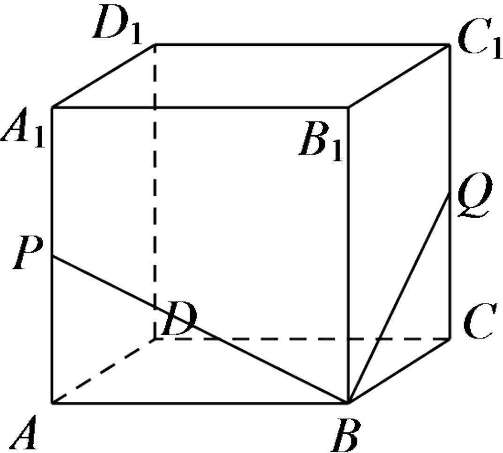

<!-- question-source:start -->
1. 【单选题】在正方体 $ABCD-A_{I}B_{I}C_{I}D_{I}$ 中，已知P,Q分别是 $A_{A_{I}},C_{C_{I}}$ 的中点，则过点B,P,Q的截面是（）

A. 正方形  
B. 邻边不等的矩形  
C. 不是正方形的菱形

D.邻边不等的平行四边形
<!-- question-source:end -->

![[高中/课堂同步/智慧中小学/必修第二册/第八章 立体几何初步/8.5.2 直线与平面平行/8_5_2直线与平面平行_2_/一_单选题/习题/answers/Q00052379A1.md]]
