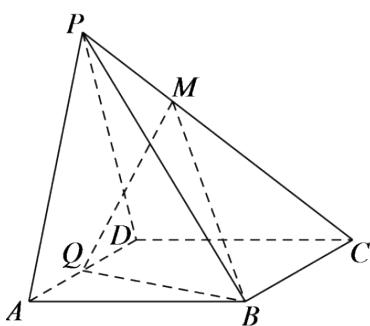

<!-- question-source:start -->
3.【填空题】如图，在四棱锥P-ABCD中，底面ABCD为菱形， $\angle BAD=60^{\circ}$ ，Q为AD的中点，点M在线段PC上， $PM=\lambda PC,\quad PA\parallel$ 平面MQB，则实数 $\lambda=$ \_\_\_\_。

<!-- question-source:end -->

![[高中/课堂同步/智慧中小学/必修第二册/第八章 立体几何初步/8.5.2 直线与平面平行/8_5_2直线与平面平行_2_/三_填空题/习题/answers/Q00052381A1.md]]
