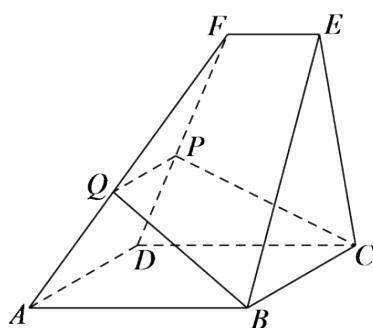

> [!faq]- 《8.5.2直线与平面平行(2)》答案与解析
>
> > [!success]- **【答案】** 详见解析
>
> > [!note]- **【解析】**
> > 证明： $PQ \parallel$ 平面ABCD。
> >
> > 
> >
> > 【正确答案】请查看本题解析视频。
> >
> > 【更多习题信息】
> >
> > 难易度：适中
> >
> > 知识点：直线与平面平行的性质定理
> >
> > 【智慧中小学APP扫码查看完整解析】
> >
> > 
