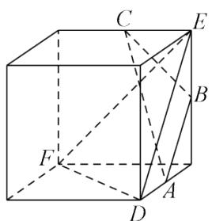
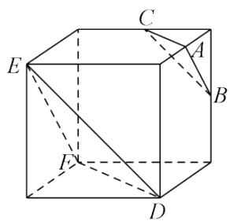
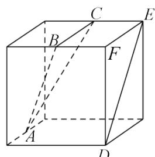
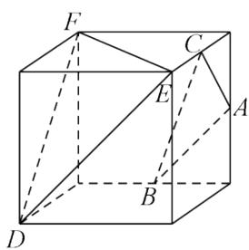

<!-- question-source:start -->
1.【单选题】下列四个正方体的图形中，A,B,C为正方体所在棱的中点，则能得出平面ABC//平面DEF的是（）

A.

B.

C.

D.

<!-- question-source:end -->

![[高中/课堂同步/智慧中小学/必修第二册/第八章 立体几何初步/8.5.3 平面与平面平行/8_5_3平面与平面平行_1_/一_单选题/习题/answers/Q00052395A1.md]]
