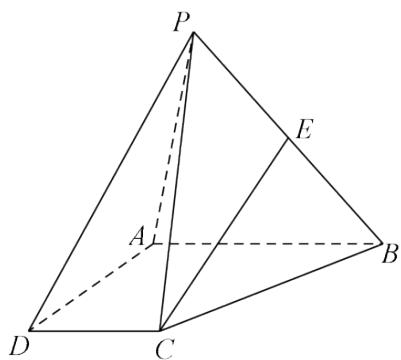

<!-- question-source:start -->
4.【问答题】如图，四棱锥P-ABCD中， $AB//DC$ ，AB=2DC，E为PB的中点。

（1）求证：CE//平面PAD;

(2) 在线段 $AB$ 上是否存在一点 $F$ , 使得平面 $PAD$ 平面 $CEF$

？若存在，证明你的结论，若不存在，请说明理由。

<!-- question-source:end -->

![[高中/课堂同步/智慧中小学/必修第二册/第八章 立体几何初步/8.5.3 平面与平面平行/8_5_3平面与平面平行_1_/三_问答题/习题/answers/Q00052398A1.md]]
