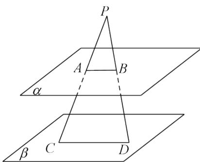

<!-- question-source:start -->
4.【问答题】如图，已知平面 $\alpha //$ 平面 $\beta$ ， $P\notin\alpha$ ，且 $P\notin\beta$ ，过点 $P$ 的直线 $m$ 与 $\alpha, \beta$ 分别交于点 $A, C$ ，过点 $P$ 的直线 $n$ 与 $\alpha, \beta$ 分别交于点 $B, D$ ，且 $PA = 6, AC = 9, PD = 8$ ，求 $BD$ 的长。

<!-- question-source:end -->

![[高中/课堂同步/智慧中小学/必修第二册/第八章 立体几何初步/8.5.3 平面与平面平行/8_5_3平面与平面平行_2_/三_问答题/习题/answers/Q00052394A1.md]]
