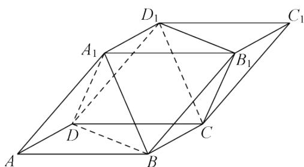

> [!faq]- 《8.5.3平面与平面平行(2)》答案与解析
>
> > [!success]- **【答案】** 详见解析
>
> > [!note]- **【解析】**
> > 证明：平面 $A_{l}BD$ //平面 $CD_{l}B_{l}$ ;
> >
> > （2）若平面ABCD与平面 $B_{1}D_{1}C$ 交于直线l，
> > 证明： $B_{1}D_{1}//l$ 。
> >
> > 
> >
> > 【正确答案】请查看本题解析视频  
> > 【更多习题信息】  
> > 难易度：适中  
> > 知识点：平面与平面平行的性质定理  
> > 【智慧中小学APP扫码查看完整解析】
> >
> > 
