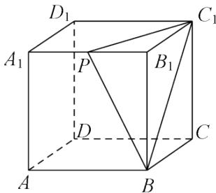

<!-- question-source:start -->
2.【填空题】在棱长为2的正方体 $ABCD-A_{1}B_{1}C_{1}D_{1}$ 中，P是 $A_{1}B_{1}$ 的中点，过点 $A_{2}$ 作与平面PB $C_{1}$ 平行的截面，所得截面的面积是\_\_\_\_。

<!-- question-source:end -->

![[高中/课堂同步/智慧中小学/必修第二册/第八章 立体几何初步/8.5.3 平面与平面平行/8_5_3平面与平面平行_2_/二_填空题/习题/answers/Q00052392A1.md]]
