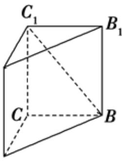

<!-- question-source:start -->
5.【问答题】在直三棱柱 $ABC-A_{1}B_{1}C_{1}$ 中， $AC\perp BC$ ，求证： $AC\perp BC_{1}$

$A_{1}$
<!-- question-source:end -->

![[高中/课堂同步/智慧中小学/必修第二册/第八章 立体几何初步/8.6.1 直线与直线垂直/8_6_1直线与直线垂直/三_问答题/习题/answers/Q00052403A1.md]]
