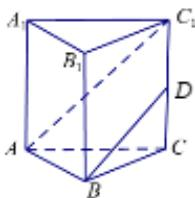

<!-- question-source:start -->
2.【填空题】在正三棱柱 $ABC-A_{1}B_{1}C_{1}$ 中，D为 $CC_{1}$ 的中点，AB=2， $AA_{1}=2\sqrt{2}$

，求直线 $AC_{1}$ 与BD所成角的大小为\_\_\_\_

<!-- question-source:end -->

![[高中/课堂同步/智慧中小学/必修第二册/第八章 立体几何初步/8.6.1 直线与直线垂直/8_6_1直线与直线垂直/二_填空题/习题/answers/Q00052400A1.md]]
