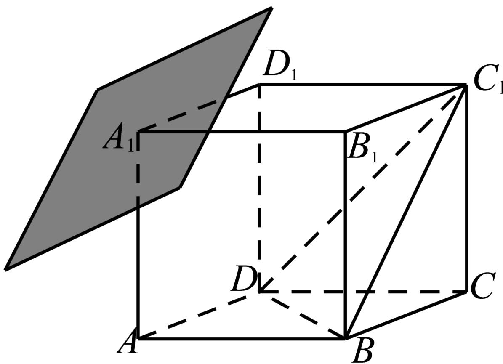

<!-- question-source:start -->
3.【填空题】如图，平面α过正方体ABCD - $A_{1}B_{1}C_{1}D_{1}$ 的顶点 $A_{1}$ ，α // 平面 $C_{1}BD$ ，α ∩ 平面ABCD = m，α ∩ 平面 $ABB_{1}A_{1} = n$ ，则m, n所成角的正弦值为\_\_\_\_。

<!-- question-source:end -->

![[高中/课堂同步/智慧中小学/必修第二册/第八章 立体几何初步/8.6.1 直线与直线垂直/8_6_1直线与直线垂直/二_填空题/习题/answers/Q00052401A1.md]]
