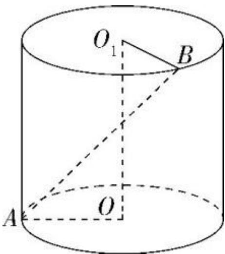

<!-- question-source:start -->
4.【填空题】如图, 圆柱 $OO_{1}$ 中, 底面半径为 1, $OA \perp OB$ , 异面直线 $AB$ 与 $OO_{1}$ 所成角的正切值为 $\frac{\sqrt{2}}{4}$ , 则该圆柱 $OO_{1}$ 的体积为 \_\_\_\_

<!-- question-source:end -->

![[高中/课堂同步/智慧中小学/必修第二册/第八章 立体几何初步/8.6.1 直线与直线垂直/8_6_1直线与直线垂直/二_填空题/习题/answers/Q00052402A1.md]]
