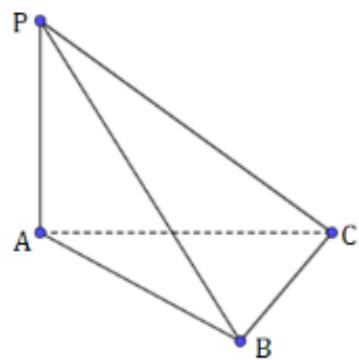

<!-- question-source:start -->
1.【单选题】如图所示的三棱锥 $P-$

ABC中， $PA \perp$ 平面ABC， $BC \perp AC$ ，则图中直角三角形的个数为（）

A. 4

B. 3

C. 2

D. 1
<!-- question-source:end -->

![[高中/课堂同步/智慧中小学/必修第二册/第八章 立体几何初步/8.6.2 直线与平面垂直/8_6_2直线与平面垂直_1_/一_单选题/习题/answers/Q00052404A1.md]]
