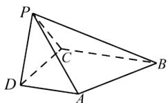

<!-- question-source:start -->
3.【问答题】如图，在四棱锥P-ABCD中， $AD \perp$ 平面PDC， $AD \parallel BC$ ， $PD \perp PB$ ， $AD = 1$ ， $BC = 3$ ， $CD = 4$ ， $PD = 2$ 。求直线AB与平面PBC所成角的余弦值。

<!-- question-source:end -->

![[高中/课堂同步/智慧中小学/必修第二册/第八章 立体几何初步/8.6.2 直线与平面垂直/8_6_2直线与平面垂直_1_/三_问答题/习题/answers/Q00052406A1.md]]
