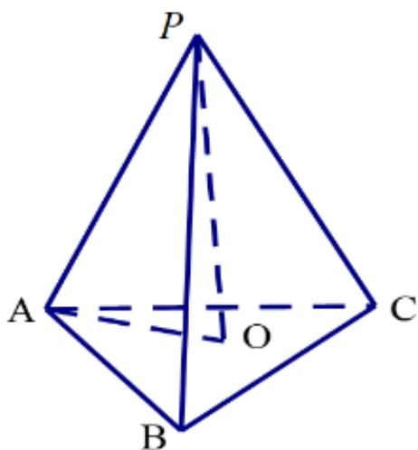

<!-- question-source:start -->
2.【填空题】已知正三棱锥P-ABC的所有棱长都相等，则PA与平面ABC所成角的余弦值为\_\_\_\_。

<!-- question-source:end -->

![[高中/课堂同步/智慧中小学/必修第二册/第八章 立体几何初步/8.6.2 直线与平面垂直/8_6_2直线与平面垂直_1_/二_填空题/习题/answers/Q00052405A1.md]]
