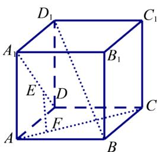

<!-- question-source:start -->
3.【问答题】如图，正方体ABCD-

$A_{1}B_{1}C_{1}D_{1}$ 中，E、F分别为 $A_{1}D$ 、AC上的点，且 $EF\perp A_{1}D$ ， $EF\perp AC.$ 求证： $EF//BD_{1}$

<!-- question-source:end -->

![[高中/课堂同步/智慧中小学/必修第二册/第八章 立体几何初步/8.6.2 直线与平面垂直/8_6_2直线与平面垂直_2_/三_问答题/习题/answers/Q00052409A1.md]]
