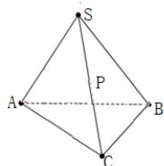

<!-- question-source:start -->
4.【问答题】已知在 $\Delta ABC$ 中， $AC = BC = 1, AB = \sqrt{2}, S$ 是 $\Delta ABC$ 所在平面外一点， $SA = SB = 2$ ， $SC = \sqrt{5}$ $P$ 是 $SC$ 的中点，求 $P$ 到平面 $ABC$ 的距离.

<!-- question-source:end -->

![[高中/课堂同步/智慧中小学/必修第二册/第八章 立体几何初步/8.6.2 直线与平面垂直/8_6_2直线与平面垂直_2_/三_问答题/习题/answers/Q00052410A1.md]]
