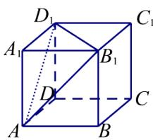

<!-- question-source:start -->
2.【填空题】在正方体 $ABCD - A_{1}B_{1}C_{1}D_{1}$ 中， $AB = 1$ ，则 $A_{1}$ 到平面 $AB_{1}D_{1}$ 的距离为

<!-- question-source:end -->

![[高中/课堂同步/智慧中小学/必修第二册/第八章 立体几何初步/8.6.2 直线与平面垂直/8_6_2直线与平面垂直_2_/二_填空题/习题/answers/Q00052408A1.md]]
