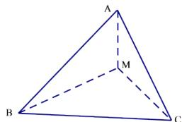

<!-- question-source:start -->
1.【单选题】在等腰直角 $\Delta ABC$ 中， $AB=BC=1$ ， $M$ 为 $AC$ 的中点，沿 $BM$ 把 $\Delta ABC$ 折成二面角，折后 $A$ 与 $C$ 的距离为 $\frac{\sqrt{6}}{2}$ ，则二面角 $C—BM—A$ 的大小为（）

A. $120^{\circ}$

B. $30^{\circ}$

C. $60^{\circ}$

D. $150^{\circ}$
<!-- question-source:end -->

![[高中/课堂同步/智慧中小学/必修第二册/第八章 立体几何初步/8.6.3 平面与平面垂直/8_6_3平面与平面垂直_1_/一_单选题/习题/answers/Q00052422A1.md]]
