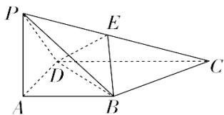

<!-- question-source:start -->
3.【问答题】如图，在四棱锥 $P - ABCD$ 中， $PA \perp$ 底面 $ABCD$ ，底面 $ABCD$ 为梯形， $AB \parallel CD$ ，且 $CD = 2AB$ . 若 $E$ 为线段 $PC$ 上一点，试确定点 $E$ 的位置，使得平面 $EBD \perp$ 平面 $ABCD$ ，并说明理由.

<!-- question-source:end -->

![[高中/课堂同步/智慧中小学/必修第二册/第八章 立体几何初步/8.6.3 平面与平面垂直/8_6_3平面与平面垂直_1_/三_问答题/习题/answers/Q00052424A1.md]]
