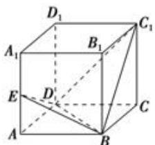

<!-- question-source:start -->
4.【问答题】如图，正方体 $ABCD-A_{1}B_{1}C_{1}D_{1}$ 中，E是 $AA_{1}$ 的中点，求证：平面 $C_{1}BD\perp$ 平面BDE.

<!-- question-source:end -->

![[高中/课堂同步/智慧中小学/必修第二册/第八章 立体几何初步/8.6.3 平面与平面垂直/8_6_3平面与平面垂直_1_/三_问答题/习题/answers/Q00052425A1.md]]
