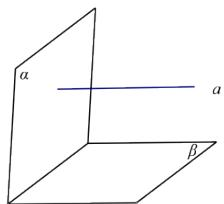

<!-- question-source:start -->
5.【问答题】如图，已知直线 $a \perp$ 平面 $a$ ，直线 $a \parallel$ 平面 $\beta$ 。求证：平面 $a \perp$ 平面 $\beta$ 。

<!-- question-source:end -->

![[高中/课堂同步/智慧中小学/必修第二册/第八章 立体几何初步/8.6.3 平面与平面垂直/8_6_3平面与平面垂直_1_/三_问答题/习题/answers/Q00052426A1.md]]
