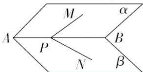

<!-- question-source:start -->
2.【填空题】如图，P是二面角 $\alpha - AB - \beta$ 的棱AB上一点，分别在 $\alpha$ ， $\beta$ 上引射线PM，PN．若 $\angle BPM = \angle BPN = 45^{\circ}$ ， $\angle MPN = 60^{\circ}$ ，则二面角 $\alpha - AB - \beta$ 的大小是\_\_\_\_．

<!-- question-source:end -->

![[高中/课堂同步/智慧中小学/必修第二册/第八章 立体几何初步/8.6.3 平面与平面垂直/8_6_3平面与平面垂直_1_/二_填空题/习题/answers/Q00052423A1.md]]
