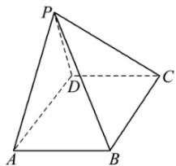

<!-- question-source:start -->
1.【单选题】如图，在四棱锥 $P -$

ABCD中，底面ABCD为矩形，平面PAD⊥平面ABCD，则下列说法中错误的是（）

A.平面 $PAB\bot$ 平面PADB.平面 $PAD\bot$ 平面PDCC. $AB\bot PD$

D. 平面PAD⊥平面PBC
<!-- question-source:end -->

![[高中/课堂同步/智慧中小学/必修第二册/第八章 立体几何初步/8.6.3 平面与平面垂直/8_6_3平面与平面垂直__2_/一_单选题/习题/answers/Q00052411A1.md]]
