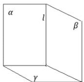

<!-- question-source:start -->
2.【问答题】已知三个平面 $\alpha, \beta, \gamma$ ，满足 $\alpha \perp \gamma$ ， $\beta \perp \gamma$ ， $\alpha \cap \beta = l$ 求证： $l \perp \gamma$

<!-- question-source:end -->

![[高中/课堂同步/智慧中小学/必修第二册/第八章 立体几何初步/8.6.3 平面与平面垂直/8_6_3平面与平面垂直__2_/二_问答题/习题/answers/Q00052412A1.md]]
