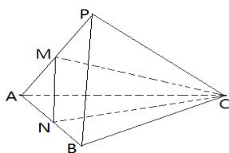

<!-- question-source:start -->
3.【问答题】如图，在三棱锥P-

ABC中, 平面PAB⊥平面PAC, AB⊥BP, M、N分别为PA、AB的中点. AC=PC, 求证: AB⊥平面CMN.

<!-- question-source:end -->

![[高中/课堂同步/智慧中小学/必修第二册/第八章 立体几何初步/8.6.3 平面与平面垂直/8_6_3平面与平面垂直__2_/二_问答题/习题/answers/Q00052413A1.md]]
