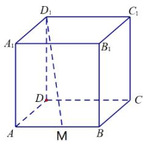

<!-- question-source:start -->
1.【单选题】如图，在棱长为1的正方体ABCD-

$A_{1}B_{1}C_{1}D_{1}$ 中，M为棱AB的中点，动点P在侧面 $BCC_{1}B_{1}$ 及其边界上运动，总有 $AP\perp D_{1}M$ ，则动点P的轨迹的长度为（）

A. $\frac{\sqrt{2}}{2}$ B. $\frac{\sqrt{5}}{2}$ C. $\frac{\pi}{16}$ D. $\frac{\sqrt{3}}{2}$
<!-- question-source:end -->

![[高中/课堂同步/智慧中小学/必修第二册/第八章 立体几何初步/小结/小结_1_空间直线_平面的垂直/一_单选题/习题/answers/Q00052417A1.md]]
