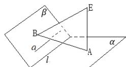

<!-- question-source:start -->
4.【问答题】如图，已知平面 $\alpha\cap$ 平面 $\beta=l$ ， $EA\perp\alpha$ ，垂足为点A， $EB\perp\beta$ ，垂足为点A，直线 $a\subset\beta$ ， $a\perp AB$ ，求证： $l//a$

<!-- question-source:end -->

![[高中/课堂同步/智慧中小学/必修第二册/第八章 立体几何初步/小结/小结_1_空间直线_平面的垂直/四_问答题/习题/answers/Q00052420A1.md]]
