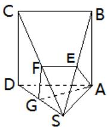

<!-- question-source:start -->
5.【问答题】如图，ABCD为正方形，SA⊥平面ABCD,过A作垂直于SC的平面交SB、SC、SD分别于E、F、G，求证：AE⊥SB

<!-- question-source:end -->

![[高中/课堂同步/智慧中小学/必修第二册/第八章 立体几何初步/小结/小结_1_空间直线_平面的垂直/四_问答题/习题/answers/Q00052421A1.md]]
