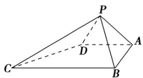

<!-- question-source:start -->
1.【单选题】如图，在四棱锥P-ABCD中， $\angle ABC=\angle BAD=90^{\circ}$ ，BC=2AD， $\triangle PAB$ 和 $\triangle PAD$ 都是等边三角形，则异面直线CD与PB所成角的大小为（）

A. $90^{\circ}$ B. $75^{\circ}$ C. $60^{\circ}$ D. $45^{\circ}$
<!-- question-source:end -->

![[高中/课堂同步/智慧中小学/必修第二册/第八章 立体几何初步/小结/小结_2_空间中的角/一_单选题/习题/answers/Q00052414A1.md]]
