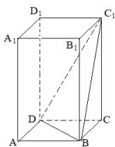

<!-- question-source:start -->
2.【单选题】正四棱柱 $ABCD - A_{1}B_{1}C_{1}D_{1}$ 中， $AA_{1} = 2AB$ ，则 $CD$ 与平面 $BDC_{1}$ 所成角的正弦值等于（）

A. $\frac{2}{3}$

B. $\frac{\sqrt{3}}{3}$

C. $\frac{\sqrt{2}}{3}$

D. $\frac{1}{3}A$
<!-- question-source:end -->

![[高中/课堂同步/智慧中小学/必修第二册/第八章 立体几何初步/小结/小结_2_空间中的角/一_单选题/习题/answers/Q00052415A1.md]]
