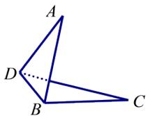

<!-- question-source:start -->
3.【问答题】如图，已知 $\square ABCD$ 中， $AB = 3\sqrt{2}$ ， $AD = 2\sqrt{3}$ ， $BD = \sqrt{6}$

，沿BD将其折成一个锐二面角A-BD-C，折后AB⊥CD.求二面角A-BD-C的大小.

<!-- question-source:end -->

![[高中/课堂同步/智慧中小学/必修第二册/第八章 立体几何初步/小结/小结_2_空间中的角/二_问答题/习题/answers/Q00052416A1.md]]
