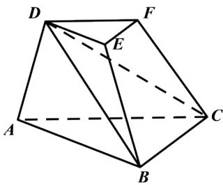

<!-- question-source:start -->
4.【复合题】如图，在三棱台ABC-中，平面ACFD⊥平面DBC， $\angle ACB=60^{\circ}$ ， $\angle ACD=45^{\circ}$ ， $AC=\sqrt{2}AD$ 。

(1)【问答题】
<!-- question-source:end -->

![[高中/课堂同步/智慧中小学/必修第二册/第八章 立体几何初步/小结/小结_3_综合问题/三_复合题/习题/answers/Q00052430A1.md]]
