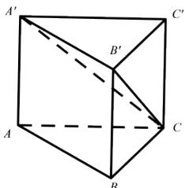

<!-- question-source:start -->
3.【填空题】如图， $ABC-A'B'C'$ 是棱长均为1的直三棱柱，则四棱锥 $C-AA'B'B$ 的体积是\_\_\_\_。

<!-- question-source:end -->

![[高中/课堂同步/智慧中小学/必修第二册/第八章 立体几何初步/小结/小结_3_综合问题/二_填空题/习题/answers/Q00052429A1.md]]
