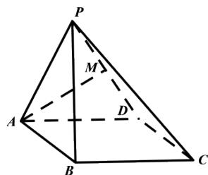

<!-- question-source:start -->
4.【复合题】如图，在四棱锥P-

ABCD中，底面ABCD为正方形，侧面PAD为正三角形，侧面PAD⊥底面ABCD，M是PD的中点。

(1)【问答题】求证： $AM \perp$ 平面PCD;

(2)【问答题】求侧面PBC与底面ABCD所成二面角的余弦值。
<!-- question-source:end -->

![[高中/课堂同步/智慧中小学/必修第二册/第八章 立体几何初步/小结/小结_4_综合问题/三_复合题/习题/answers/Q00052435A1.md]]
