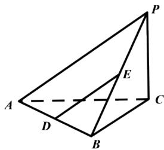

<!-- question-source:start -->
5.【复合题】如图，在三棱锥P-ABC中，PC⊥平面ABC，AB⊥BC，D，E分别是AB，PB的中点。

求证：

(1)【问答题】DE//平面PAC;

(2)【问答题】 $AB \perp PB$ 。
<!-- question-source:end -->

![[高中/课堂同步/智慧中小学/必修第二册/第八章 立体几何初步/小结/小结_4_综合问题/三_复合题/习题/answers/Q00052436A1.md]]
