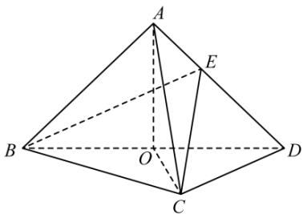

<!-- question-source:start -->
1.【复合题】如图，在三棱锥A-BCD中，平面ABD⊥平面BCD，AB=AD，O为BD的中点。

(1)【问答题】求证： $OA \perp CD$

(2)【问答题】若 $\triangle OCD$ 是边长为1的等边三角形，点 $E$ 在棱 $AD$ 上， $DE=2EA$ ，且二面角 $E-BC-D$ 的大小为 $45^{\circ}$ ，求三棱锥 $A-BCD$ 的体积。
<!-- question-source:end -->

![[高中/课堂同步/智慧中小学/必修第二册/第八章 立体几何初步/小结/小结_5_综合问题/一_复合题/习题/answers/Q00052437A1.md]]
