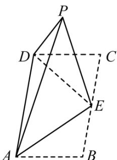

<!-- question-source:start -->
2.【复合题】如图，在矩形ABCD中， $AB=\sqrt{2}$ ，BC=2，E为BC的中点，把△ABE和△CDE分别沿AE，DE折起，使点B与点C重合于点P。

(1)【问答题】求证：平面 $PDE \perp$ 平面PAD;

(2)【问答题】求二面角P - AD - E的大小。
<!-- question-source:end -->

![[高中/课堂同步/智慧中小学/必修第二册/第八章 立体几何初步/小结/小结_5_综合问题/一_复合题/习题/answers/Q00052438A1.md]]
