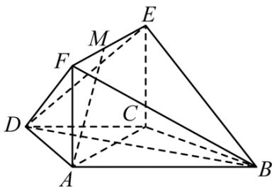

<!-- question-source:start -->
3.【复合题】如图，在梯形ABCD中， $AB \parallel CD$ ，AD = DC = CB = a， $\angle ABC = 60^{\circ}$ ，平面ACEF ⊥ 平面ABCD，四边形ACEF是矩形。

(1)【问答题】求证： $BC \perp$ 平面ACEF;

(2)【问答题】在线段EF上是否存在点M，使得AM//平面BDE？若存在，求出FM的长；若不存在，请说明理由。
<!-- question-source:end -->

![[高中/课堂同步/智慧中小学/必修第二册/第八章 立体几何初步/小结/小结_5_综合问题/一_复合题/习题/answers/Q00052439A1.md]]
