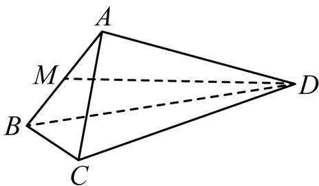

<!-- question-source:start -->
4.【复合题】如图，在四面体ABCD中， $\triangle ABC$ 是等边三角形，平面 $ABC \perp$ 平面 $ABD$ ， $M$ 为棱 $AB$ 的中点， $AB = 2$ ， $AD = 2\sqrt{3}$ ， $\angle BAD = 90^{\circ}$ 。

(1)【问答题】求证： $AD \perp BC;$

(2)【问答题】求异面直线BC与MD所成角的余弦值;
<!-- question-source:end -->

![[高中/课堂同步/智慧中小学/必修第二册/第八章 立体几何初步/小结/小结_5_综合问题/一_复合题/习题/answers/Q00052440A1.md]]
