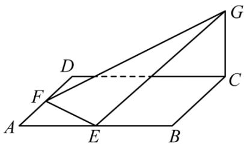

<!-- question-source:start -->
5.【问答题】如图，已知ABCD是边长为4的正方形，E，F分别是边AB，AD的中点，GC垂直于ABCD所在平面，且GC=2，求点B到平面EFG的距离。

<!-- question-source:end -->

![[高中/课堂同步/智慧中小学/必修第二册/第八章 立体几何初步/小结/小结_5_综合问题/二_问答题/习题/answers/Q00052441A1.md]]
