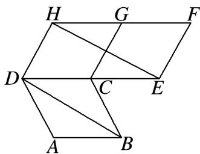

<!-- question-source:start -->
1.【单选题】如图所示，四边形ABCD,CEFG,CGHD

是全等的菱形，则下列结论中不一定成立的是（）

A. $|\overrightarrow{AB}| = |\overrightarrow{EF}|$

B. $\overrightarrow{AB}$ 与 $\overrightarrow{FH}$ 共线

C. $|\overrightarrow{BD}| = |\overrightarrow{EH}|$

D. $\overrightarrow{CD} = \overrightarrow{FG}$
<!-- question-source:end -->

![[高中/课堂同步/智慧中小学/必修第二册/第六章 平面向量及其应用/6.1 平面向量的概念/6_1平面向量的概念/smartedu_bixiu2_平面向量概念/对点训练/answers/Q00052457A1.md]]
