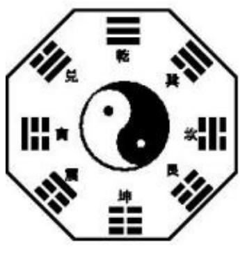
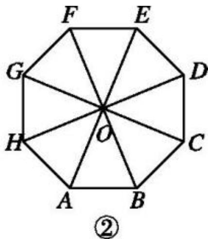

<!-- question-source:start -->
5.【填空题】八卦是中国文化中的基本哲学概念, 如图①是八卦模型图, 其外形为图②所示的正八边形 $ABCDEFGH$ 其中点 $O$ 是正八边形的中心, 记 $OA = 1$ 。在 $A,B,C,D,E,F,G,H$ 以及中心 $O$ 九个点中任意取两点分别为起点与终点的向量中, 模等于1的向量有\_\_\_\_个? 模等于 $\sqrt{2}$ 的向量有\_\_\_\_个? 与 $\overrightarrow{AB}$ 方向相同或相反的向量共有\_\_\_\_个?

<!-- question-source:end -->

![[高中/课堂同步/智慧中小学/必修第二册/第六章 平面向量及其应用/6.1 平面向量的概念/6_1平面向量的概念/smartedu_bixiu2_平面向量概念/对点训练/answers/Q00056163A1.md]]
