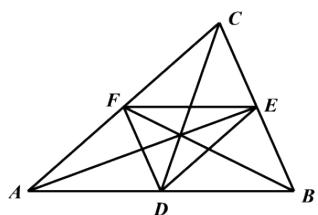

<!-- question-source:start -->
3.【问答题】如图，点D,E,F分别为 $\triangle ABC$ 的三边AB,BC,CA的中点.

证明：
（1） $\overrightarrow{BA}+\overrightarrow{AF}=\overrightarrow{BC}+\overrightarrow{CF};$

(2) $\overrightarrow{AE} +\overrightarrow{BF} +\overrightarrow{CD} = 0.$
<!-- question-source:end -->

![[高中/课堂同步/智慧中小学/必修第二册/第六章 平面向量及其应用/6.2 平面向量的运算/向量线性运算习题课/smartedu_bixiu2_向量线性运算习题课/对点训练/answers/Q00056184A1.md]]
