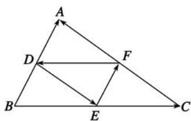

<!-- question-source:start -->
1. 【单选题】已知D,E,F分别是 $\triangle ABC$ 边AB,BC,CA的中点，则下列等式中不正确的是( ).

A. $\overrightarrow{FD} +\overrightarrow{DA} = \overrightarrow{FA}$

B. $\overrightarrow{FD} +\overrightarrow{EF} +\overrightarrow{DE} = \overrightarrow{BC}$

C. $\overrightarrow{DE} +\overrightarrow{DA} = \overrightarrow{EC}$

D. $\overrightarrow{DF} +\overrightarrow{DE} = \overrightarrow{DC}$
<!-- question-source:end -->

![[高中/课堂同步/智慧中小学/必修第二册/第六章 平面向量及其应用/6.2.1 向量的加法运算/6_2_1向量的加法运算/smartedu_bixiu2_平面向量加法运算/对点训练/answers/Q00052445A1.md]]
