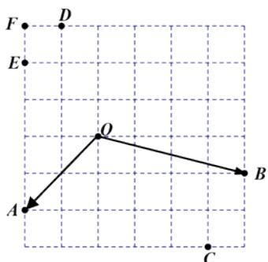

<!-- question-source:start -->
2.【单选题】如图所示的方格纸中有定点O,A,B,C,D,E,F，则 $\overrightarrow{OA}+\overrightarrow{OB}=$ （）.

A. $\overrightarrow{OC}$ B. $\overrightarrow{OD}$ C. $\overrightarrow{FO}$ D. $\overrightarrow{EO}$

知识点：向量的加法运算与向量加法的几何意义
【智慧中小学APP扫码查看完整解析】

## 二、填空题（共1题）
<!-- question-source:end -->
