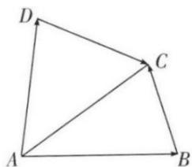

<!-- question-source:start -->
1.【单选题】如图，在四边形ABCD中，设 $\overrightarrow{AB}=a,\quad\overrightarrow{AD}=b,\quad\overrightarrow{DC}=c$ ，则 $\overrightarrow{BC}$ 等于（）.

A. $a - b + c$

B. $b - a - c$

C. $a + b + c$

D. $b - a + c$
<!-- question-source:end -->

![[高中/课堂同步/智慧中小学/必修第二册/第六章 平面向量及其应用/6.2.2 向量的减法运算/6_2_2向量的减法运算/smartedu_bixiu2_向量的减法运算_6_2/对点训练/answers/Q00056167A1.md]]
