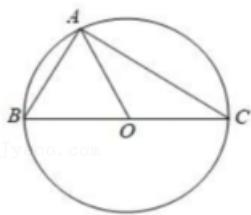

<!-- question-source:start -->
1.【单选题】已知 $\triangle ABC$ 的外接圆圆心为 0，且 $2\overrightarrow{AO} = \overrightarrow{AB} + \overrightarrow{AC}$ ， $|\overrightarrow{AO}| = |\overrightarrow{AB}|$ ，则向量 $\overrightarrow{CA}$ 在向量 $\overrightarrow{BC}$ 上的投影向量为（）.

A. $-\frac{3}{4}\overrightarrow{BC}$

B. $\frac{3}{4}\overrightarrow{BC}$

C. $\frac{\sqrt{3}}{4}\overrightarrow{BC}$

D. $-\frac{\sqrt{3}}{4}\overrightarrow{BC}$
<!-- question-source:end -->

![[高中/课堂同步/智慧中小学/必修第二册/第六章 平面向量及其应用/6.2.4 向量的数量积/6_2_4向量的数量积_2_/smartedu_bixiu2_向量的数量积/对点训练/answers/Q00056176A1.md]]
