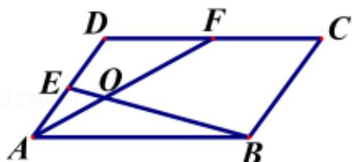

<!-- question-source:start -->
3.【复合题】平行四边形ABCD中，E，F分别为AD，DC的中点，BE与AF相交于点O，记 $\overrightarrow{AB}=a,\quad\overrightarrow{AD}=b.$

(1)【问答题】用a, b表示 $\overrightarrow{BE}$ ;

(2)【问答题】若 $\overrightarrow{AO}=\lambda\overrightarrow{AF},\quad\overrightarrow{BO}=\mu\overrightarrow{BE}$ ，求实数 $\lambda$ 和 $\mu$ 的值.
<!-- question-source:end -->

![[高中/课堂同步/智慧中小学/必修第二册/第六章 平面向量及其应用/6.3.1 平面向量基本定理/6_3_1平面向量基本定理/smartedu_bixiu2_平面向量基本定理/对点训练/answers/Q00056187A1.md]]
