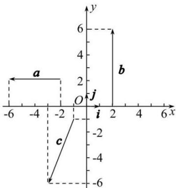

<!-- question-source:start -->
4.【填空题】如图，向量a,b,c的坐标分别是\_\_\_\_，\_\_\_\_，\_\_\_\_。

<!-- question-source:end -->

![[高中/课堂同步/智慧中小学/必修第二册/第六章 平面向量及其应用/6.3.3 平面向量加、减运算的坐标表示/6_3_2正交分解与6_3_3加减坐标表示/smartedu_bixiu2_向量加减运算坐标表示/对点训练/answers/Q00056191A1.md]]
